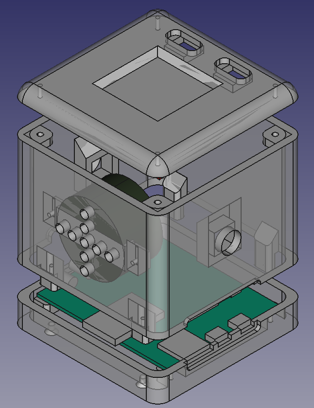

Tonie-Clone
-----------

Music and audio book box controlled by RFID tags, based on [ESP32-A1S](https://www.exp-tech.de/plattformen/esp32/9180/esp32-a1s-wi-fi-bt-soc-audio-module). This build is intentended to run on AIThinkers Audio Kit v2.2. and [PN532](https://www.funduinoshop.com/PN532-NFC-RFID-V3) NFC reader.

Todos
=====

- [x] Get ESP ADF up and running
- [x] Connect PN532 via I2C
- [x] Play music from SD card
- [ ] Add buttons for Volume and Next/Prev
- [ ] Turn off Speaker in Headphone mode
- [ ] ... TBD